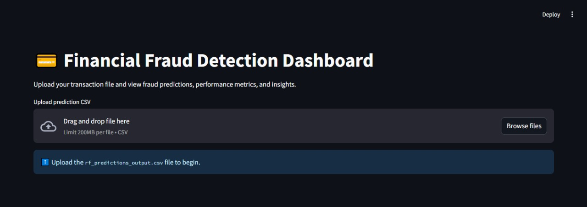
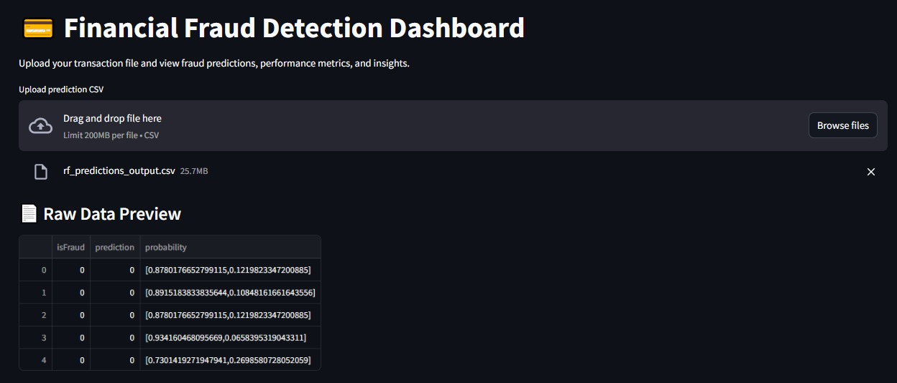
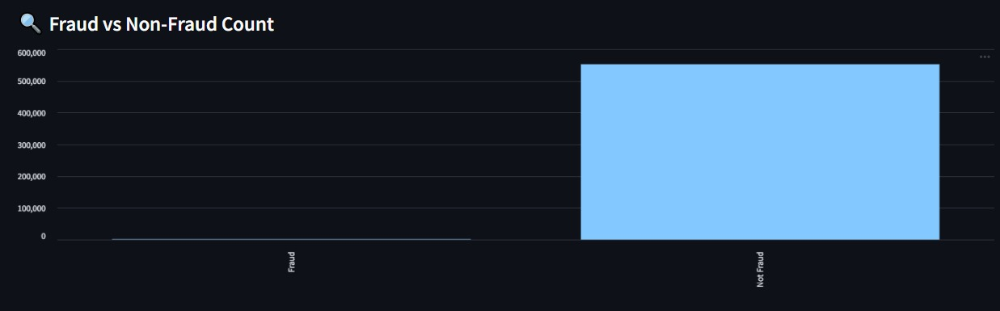

# Financial-Fraud-Detection using PySpark & MLlib
Machine Learning project using PySpark &amp; Streamlit to detect financial fraud


A scalable solution for detecting fraudulent financial transactions using PySpark, MLlib, and a simple web interface for real-time prediction.

---

## 📝 Description

This project aims to identify fraudulent transactions from a financial dataset using **Machine Learning** techniques and **PySpark**. Built for Big Data environments, the system is efficient and scalable.

### 🔍 Key Features

1. **Data Preprocessing**: Cleaned large transaction dataset using PySpark.
2. **Fraud Classification**: Trained a **Random Forest Classifier** with high precision and recall.
3. **Model Evaluation**: Evaluated with AUC, precision, recall, and accuracy metrics.
4. **Feature Importance**: Identified most influential features (e.g., oldbalanceOrg, amount).
5. **Predictions Export**: Saved model predictions for visualization or dashboarding.
6. **Web App**: Deployed a simple **Flask**-based interface to upload transactions and check for fraud.

---

## 🚀 Built With

### 📌 Languages

* 


### 🧰 Libraries & Frameworks

*  – Big data processing and ML model training
*  – Web app interface for fraud detection
* Pandas – Data manipulation
* Matplotlib – Visualizations
* Streamlit - Dashboard

---

## 🛠️ Getting Started

### ✅ Prerequisites

- Python 3.10+
- Apache Spark & PySpark
- pip for installing packages
- Git (for cloning the repo)

## 🔧 Installation

```bash
git clone https://github.com/niyatipatel2005/financial-fraud-detection.git
cd financial-fraud-detection
pip install -r requirements.txt
```

## Download the dataset

Download the dataset of financial fraud from the kaggle. 
```bash
https://www.kaggle.com/code/eryash15/financial-fraud-detection-using-pyspark-mllib/input
```

## 📊 Running the Project

### 1. Train the Model

Run the main notebook or training script to preprocess the dataset and train the model using Logistic Regression and Random Forest:

```bash
# Inside your Jupyter Notebook or script
Financial_Fraud_Detection.ipynb
```

### 2. Launch the Web App

```bash
cd fraud_detection_dashboard
streamlit run app.py
```
Then open http://localhost:8501 in your browser to test fraud predictions by uploading CSV files.

### 🖼️ Dashboard Screenshot




### 🧠 Feature Importance Output

| Feature         | Importance |
|----------------|------------|
| oldbalanceOrg  | 0.5027     |
| newbalanceDest | 0.1565     |
| amount         | 0.1473     |
| newbalanceOrig | 0.0973     |
| oldbalanceDest | 0.0643     |
| type_index     | 0.0316     |


### 📁 Project Structure

```bash
financial-fraud-detection/
│
├── fraudTrain.csv                   # Sample dataset 
├── rf_predictions_output.csv        # Model output 
├── fraud_detection_model.ipynb      # Model training notebook
├── fraud_detection_dashboard/
│   ├── app.py                       # streamlit-based dashboard
│   └── rf-predictions_output.csv
├── requirements.txt
└── README.md
```

### Output Images:






## Authors

* Niyati Patel  -  https://github.com/niyatipatel2005


## License

This project is licensed under the [NAME HERE] License - see the LICENSE.md file for details

## Acknowledgments


We would like to thank the following for their support and inspiration throughout the project:

- [Kaggle](https://www.kaggle.com/code/eryash15/financial-fraud-detection-using-pyspark-mllib/input) for providing the original dataset for financial fraud detection.
- The open-source community for tools like Apache Spark, PySpark, and MLlib that made scalable machine learning possible.
- Our mentors and professors for their guidance and motivation.
- GitHub and VS Code for being the backbone of our development workflow.
- The creators of educational blogs, tutorials, and Stack Overflow discussions that helped us overcome technical hurdles.


Inspiration, code snippets, etc.
